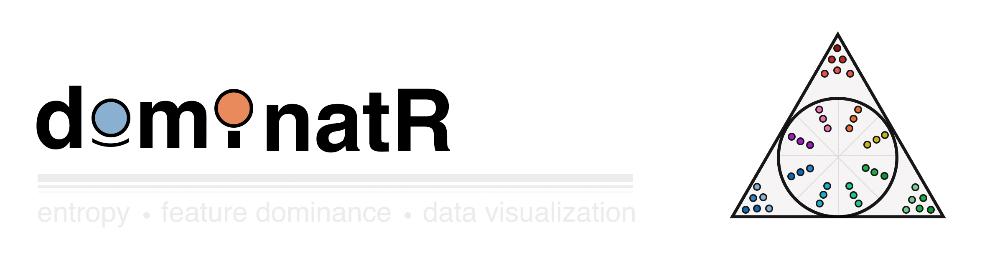
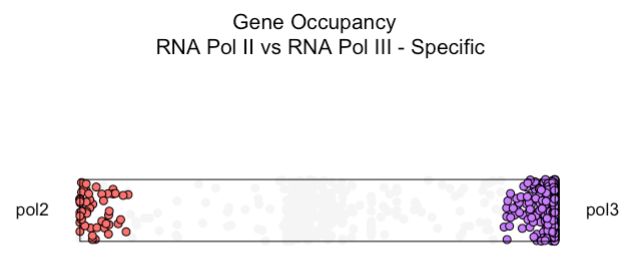
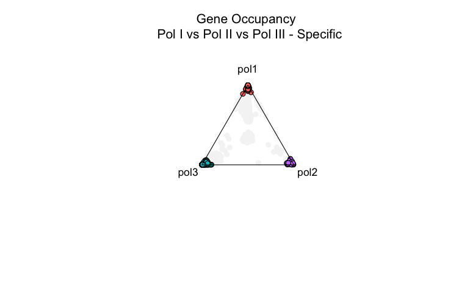
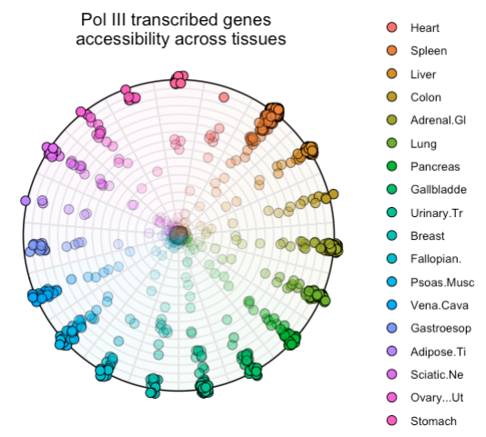

## Overview

**dominatR** is an R package for quantifying and visualizing feature dominance in datasets, it is able to integrate dataframes, matrices and SummarizedExperiment objects. dominatR makes use of Shannon's entropy to identify features that are dominated within a particular category or condition.

### Features

-   **Built-in normalization methods:** If desired, feature counts can be normalized across conditions using built-in functions for quantile normalization, min-max normalization, counts per million (cpm), reads per kb per million (rpkm), transcript per million (tpm), and others.

-   **Categorical entropy calculation:** Quickly identify features that are specific to a particular category or condition, as well as features that are relatively uniform across conditions

-   **Feature dominance plots:** Generate informative and customizable plots that highlight feature dominance, aiding data interpretation and communication. From 2 dimensions to N dimensions

## Installation

dominatR can be installed from GitHub using the `devtools` package:

``` r
# Install devtools if not already installed
if (!require(devtools)) install.packages("devtools")

# Install dominatR from GitHub
devtools::install_github("VanBortleLab/dominatR")
```

## Usage

```{r}
#load libraries
library('dominatR')
library('dominatRData')
library('SummarizedExperiment')
library('airway')
```

### **Normalization**

```{r}
data(airway)

##Saving the summarizedexperiment as se
se = airway

##Preparing the matrix
count_mat <- assay(se)
```

#### *A dataframe/matrix*

```{r}
count_min <- quantile_normalization(count_mat, new_min = 0, new_max = 1)
```

#### *A summarized experiment*

```{r}

# Option A: Overwrite the default assay
se1 <- quantile_normalization(se)

# Option B: Write to a new assay slot
se2 <- quantile_normalization(se, new_assay_name = "minmax_counts")
```

### **Feature dominance plots**

The principle for feature dominance plots follows the idea that **observations dominated** by a variable will be **located in close proximity to the edge of the respective shape.** The plots provide many aesthetic attributes to filter genes based on their entropy scores and magnitude values along with coloring and dataframe retrieval containing the information related to the analysis.

#### *Two dimensions - `plot_rope`*

Observations that lie at the center of the line are shared across the two variables.

Observations that lie at the extreme of the line are dominated by the respective variable

```{r}
data("rnapol_score")

# Subsetting the two columns of interest, can also be specified in the function by 
# calling the names of those columns
data1 <- rnapol_score[,6:7]

# The plot_rope function
plot_rope(
        data1, 
        rope_color = 'white',
        pch = c(21, 21), 
        col = c('#F8766d', '#C77CFF'),
        push_text = 1.2,
        output_table = FALSE,
        rope_width = 1,
        entropyrange = c(0, 0.5),
        maxvaluerange = c(1.3, Inf)
)


title(main = 'Gene Occupancy \n RNA Pol II vs RNA Pol III - Specific',
        font.main = 1, 
        cex = 0.5)
```



#### *Three dimensions - `plot_triangle`*

Observations that lie at the center of the triangle are shared across the three variables.

Observations that lie at the vertices are dominated by the respective variable

```{r}
data("rnapol_score")

# Subsetting the two columns of interest, can also be specified in the function by 
# calling the names of those columns
data1 = rnapol_score[,5:7]

plot_triangle(data1, 
                output_table = FALSE, 
                col = c('#F8766d', '#C77CFF', '#00BFC4'),
                entropyrange = c(0,0.5),
                label = TRUE, pch = 21,
                push_text = 1.3)

title(main = 'Gene Occupancy \n Pol I vs Pol II vs Pol III - Specific',
        font.main = 1, 
        cex = 0.5)
```



#### *N-dimensions -* `plot_circle`

Observations that lie at the center of the circle are shared across the N variables.

Observations that lie at the edge of the circle on each polygon are dominated by the respective variable

```{r}
data("atac_tissue_score")

### subsetting only a set of numerical columns
data1 = atac_tissue_score[,8:26]


plot_circle(data1, 
            point_line_colors = rep('black', 19),
            magnituderange = c(1, Inf),
            n = 19, 
            output_table = FALSE, 
            point_size = 3) + 
ggtitle('Pol III transcribed genes \n accessibility across tissues')
```



### Note

`dominatR` does not compute any significance/p-values for any observation. It serves as a tool for effective data visualization where dominance patterns serve of interest.
