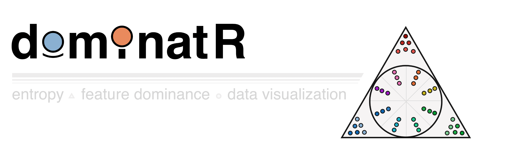

# Overview

`dominatR` is a genomic data visualization package for R. In brief, `dominatR` applies concepts drawn from physics - such as *center of mass* from classical mechanics and *Shannon's entropy* from statistical mechanics - to effectively visualize features (e.g. genes) that are present within a specific context or condition (e.g. tissue-specific gene expression). `dominatR` is able to integrate `dataframes`, `matrices` and `SummarizedExperiment` objects, perform a number of common genomic normalization methods, compute center of mass, entropy, and categorical entropy values, and generate customizable plots that serve to highlight context-relevant feature dominance. In all examples, dominance visualization is linked to the coordinate spatial localization of each data point, such that full feature dominance is projected at the radial extreme.

Below, we highlight the utility of `dominatR` with specific examples, such as three-way (triangle) visualization of RNA polymerase I, II, and III genomic occupancy dominance at enzyme-specific gene targets [(Rajendra K C et al., 2024 Molecular Cell)](https://www.sciencedirect.com/science/article/pii/S1097276524007718?dgcid=author), or such as 19-way (circular) visualization of tissue-specific gene accessibility patterns at canonical RNA Pol III-transcribed genes [(Simon Lizarazo et al., 2025 bioRxiv preprint)](https://www.biorxiv.org/content/10.1101/2025.08.28.672650v1).

## Features

-   **Built-in normalization methods:** If desired, feature counts can be normalized across conditions using built-in functions for quantile normalization, min-max normalization, counts per million (CPM), reads per kb per million (RPKM), and transcript per million (TPM).

-   **Categorical entropy calculation:** Quickly identify features that are specific to a particular category or condition, as well as features that are relatively uniform across conditions.

-   **Feature dominance plots:** Generate informative and customizable plots that highlight feature dominance, aiding data interpretation and communication. From 2 dimensions to N dimensions.

# Installation

dominatR can be installed from GitHub using the `devtools` package:

``` r
# Install devtools if not already installed
if (!require(devtools)) install.packages("devtools")

# Install dominatR from GitHub
devtools::install_github("VanBortleLab/dominatR", build_vignettes = TRUE)
```

# Usage

``` r
#load libraries
library('dominatR')
library('dominatRData')
library('SummarizedExperiment')
library('airway')
```

## **Normalization**

``` r
data(airway)

##Saving the summarizedexperiment as se
se = airway

##Preparing the matrix
count_mat <- assay(se)
```

For normalization, the package is able to integrate dataframes and summarized experiment objects. If using a `dataframe` we recommend having a numerical one. For a `summarizedexperiment` object you can provide the name of the assay you want to normalize and a new assay name to store the normalized data by using the `assay_nname` and `new_assay_name` attributes respectively. If this is not provided, the first assay in the object will be replaced.

### A dataframe/matrix

``` r
count_min <- quantile_normalization(count_mat)
```

### A summarized experiment

``` r

# Option A: Overwrite the default assay
se1 <- quantile_normalization(se)

# Option B: Write to a new assay slot
se2 <- quantile_normalization(se, new_assay_name = "quantile_counts")
```

## **Feature dominance plots**

The principle for feature dominance plots follows the idea that **observations dominated** by a variable will be **located in close proximity to the edge of the respective shape.** The plots provide many aesthetic attributes to filter genes based on their entropy scores and magnitude values along with coloring and dataframe retrieval containing the information related to the analysis.

### Two dimensions - `plot_rope`

Observations that lie at the center of the line are shared across the two variables.

Observations that lie at the extreme of the line are dominated by the respective variable

``` r
data("rnapol_score")

# Subsetting the two columns of interest, can also be specified in the function by 
# calling the names of those columns
data1 <- rnapol_score[,6:7]

# The plot_rope function
plot_rope(
        data1, 
        rope_color = 'white',
        pch = c(21, 21), 
        col = c('#7eb1d5', '#fa8451'),
        push_text = 1.2,
        output_table = FALSE,
        rope_width = 1,
        entropyrange = c(0, 0.5),
        maxvaluerange = c(1.3, Inf)
)


title(main = 'Gene Occupancy \n RNA Pol II vs RNA Pol III - Specific',
        font.main = 1, 
        cex = 0.5)
```


### Three dimensions - `plot_triangle`

Observations that lie at the center of the triangle are shared across the three variables.

Observations that lie at the vertices are dominated by the respective variable

``` r
data("rnapol_score")

# Subsetting the two columns of interest, can also be specified in the function by 
# calling the names of those columns
data1 = rnapol_score[,5:7]

plot_triangle(data1, 
                output_table = FALSE, 
                col = c('#ff80e3', '#7eb1d5', '#fa8451'),
                entropyrange = c(0,0.5),
                label = TRUE, pch = 21,
                push_text = 1.3)

title(main = 'Gene Occupancy \n Pol I vs Pol II vs Pol III - Specific',
        font.main = 1, 
        cex = 0.5)
```


### N-dimensions - `plot_circle`

Observations that lie at the center of the circle are shared across the N variables.

Observations that lie at the edge of the circle on each polygon are dominated by the respective variable

``` r
data("atac_tissue_score")

### subsetting only a set of numerical columns
data1 = atac_tissue_score[,8:26]


plot_circle(data1, 
            point_line_colors = rep('black', 19),
            magnituderange = c(1, Inf),
            n = 19, 
            output_table = FALSE, 
            point_size = 3) + 
ggtitle('Pol III transcribed genes \n accessibility across tissues')
```


## Note

`dominatR` serves strictly as a tool for effective data normalization and visualization and does not perform significance testing. However, feature-related statistics derived from other methods may be incorporated through entropy calculation and visualization on features with noted significance (for example, prefiltered gene sets, such as shown for significant RNA Pol I, II, III occupancy or gene accessibility in the usage examples noted above).
