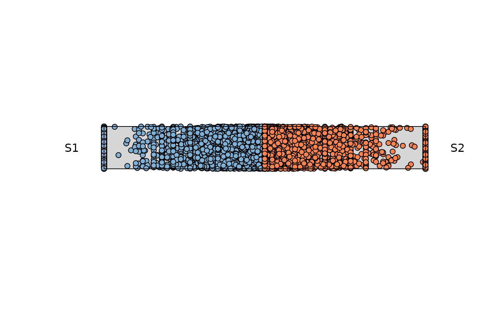
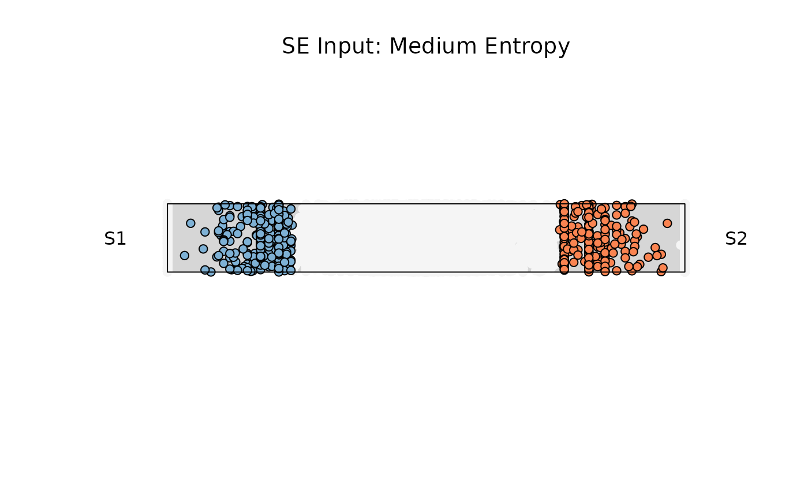
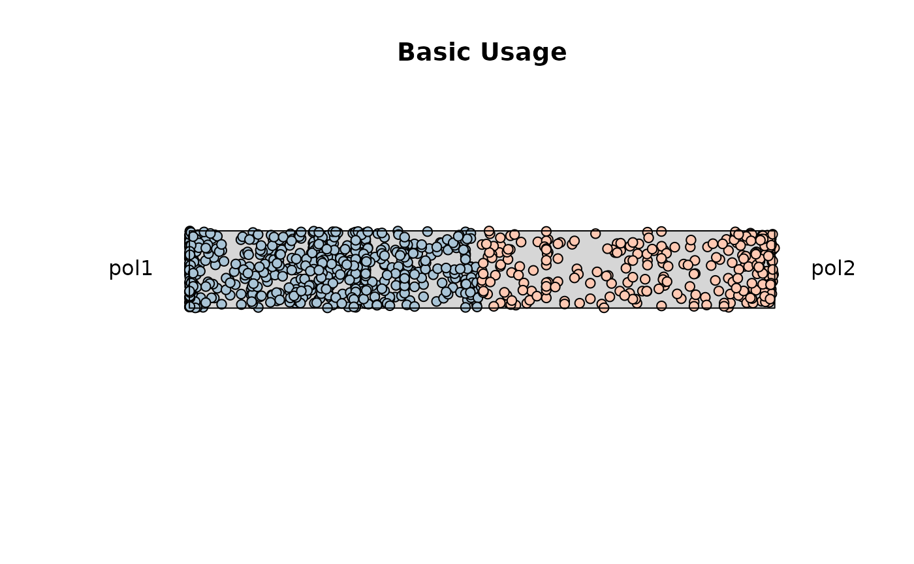
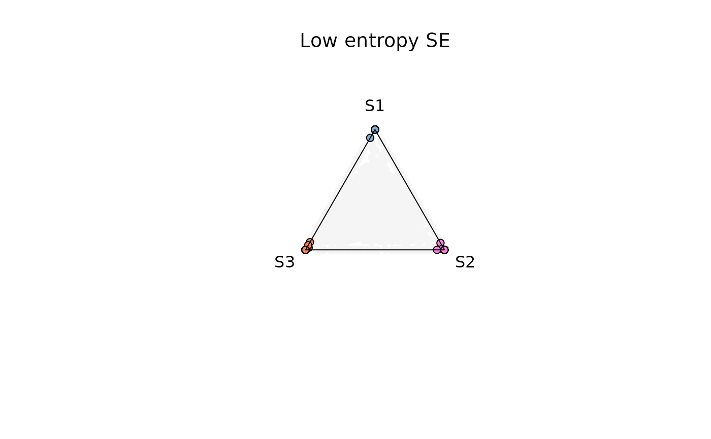
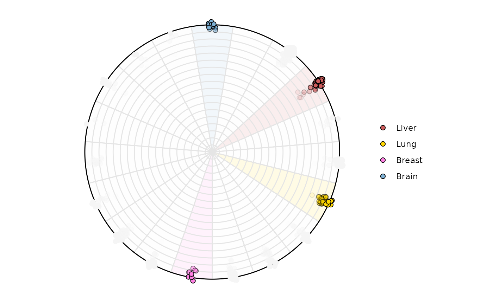
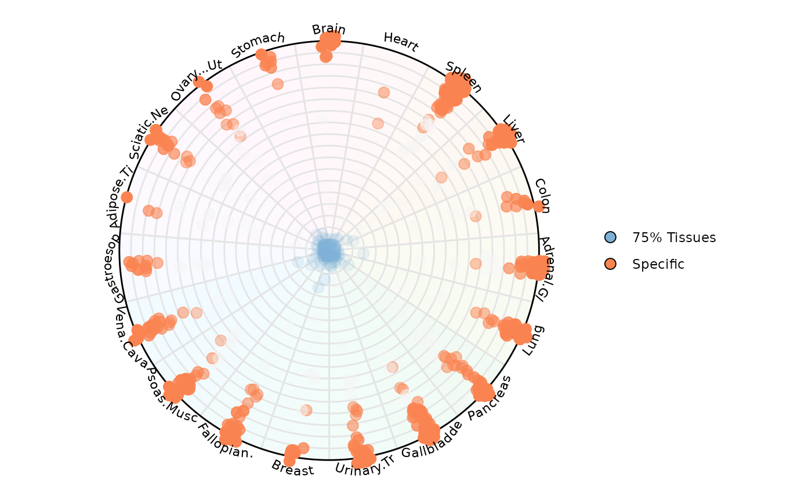
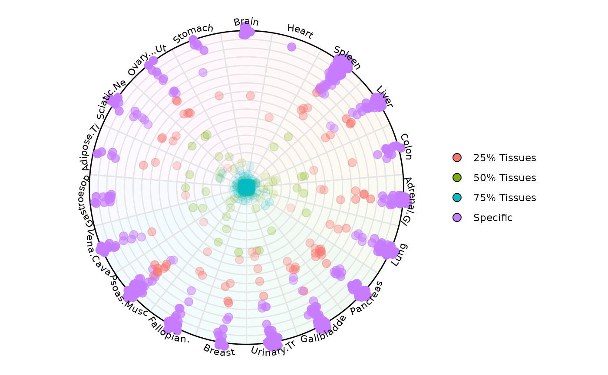
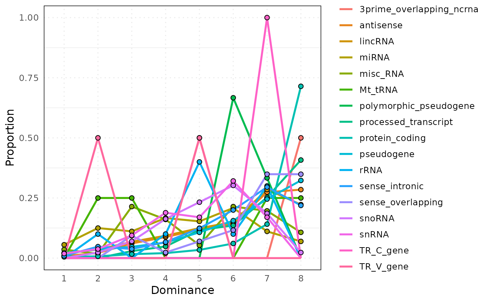
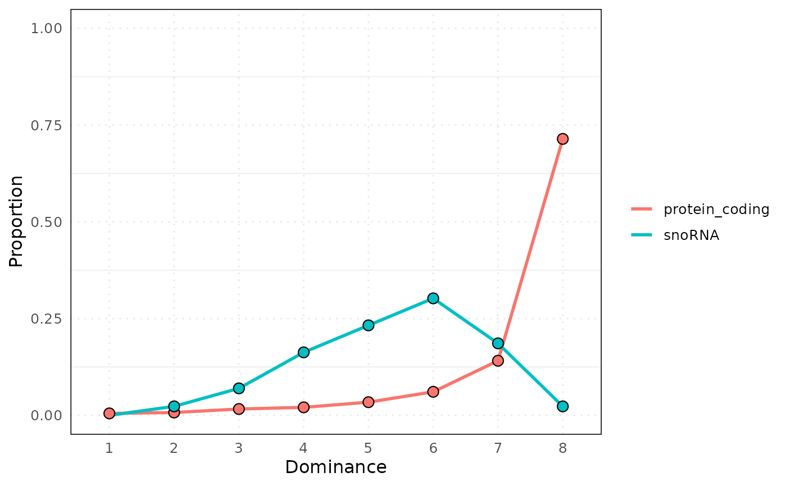

# Dominance plot in 2 to N dimensions

``` r
library(dominatR)
library(airway)
library(dominatRData)
library(ggplot2)
```

## Data

The data used in this article comes from two different sources:

1.  A `SummarizedExperiment` object from the library `airway`
2.  A `data.frame` retrieved from the supplementary library
    `dominatRData`

The purpose of using two different sources is meant to show the capacity
of dominatR to process different objects.

``` r
### summarized experiment
data("airway")
se <-airway

#Let's normalize the se object and subset
set.seed(123)
se <- cpm_normalization(se, log_trans = FALSE, new_assay_name = 'cpm_norm')
idx <- sample(seq_len(nrow(se)), size = min(25000, nrow(se)))
se <- se[idx, ]
colnames(se) <- paste0('S', seq_len(8))

# dataframe
data("rnapol_score")
df1 = rnapol_score
df1 = df1[,5:7]

data("atac_tissue_score")
df2 = atac_tissue_score
```

## Visualization Functions

Visual representation is essential for interpreting the structure,
dominance, and variability of features across samples or conditions.

Our package offers a collection of entropy-based visualization functions
designed for different analytical perspectives:

- [`plot_rope()`](https://vanbortlelab.github.io/dominatR/reference/plot_rope.md)  
  Compares two numeric vectors using a central “rope” layout to
  visualize dominance asymmetry and entropy filtering.

- [`plot_triangle()`](https://vanbortlelab.github.io/dominatR/reference/plot_Triangle.md)  
  Visualizes three variables in a ternary layout, highlighting balance
  or dominance among triplets.

- [`plot_circle()`](https://vanbortlelab.github.io/dominatR/reference/plot_circle.md)  
  Displays each sample’s entropy and average magnitude in a polar
  coordinate layout.

- [`plot_circle_frequency()`](https://vanbortlelab.github.io/dominatR/reference/plot_circle_frequency.md)  
  Summarizes the density of entropy-magnitude bins using circular heat
  segments.

Let’s now explore each visualization function with real data examples.

### plot_rope(): Rope Plot for Binary Feature Dominance

This function compares two numeric vectors (e.g., expression in
Condition A vs. B) using a “rope-like” 1D dominance visualization. Each
sample is classified by its relative dominance, optionally filtered by
entropy or magnitude thresholds.

This function is ideal for:

- Comparing two groups of measurements across matched samples or
  features.

### Using a Summarized Experiment

Using the se object and selecting two columns. By default the function
considers all the possible entropy values and magnitude values.

#### Basic Usage

``` r
sample1 <- "S1"
sample2 <- "S2"
res_rope <- plot_rope(
    x = se,
    push_text =  1.2,
    col = c('#7eb1d5', '#fa8451'),
    column_name = c(sample1, sample2), assay_name = 'cpm_norm'
)
```


The points that locate at the center of the rope, are those shared
across both variables. As the points start moving towards the end of the
rope, feature dominance is appreciated by the respective variable

The following aesthetics can be modified:

- `rope_widht`

- `rope_color`

- `rope_border`

- `col`

- `col_bg`

- `pch`

- `pch_bg`

- `cex`

- `title`

Now let’s explore the features the plotting function offers.

#### Example 1: Low entropy

Considering observations with low entropy (High Dominance) and any level
of expression. Adding a title to the plot and changing the colors for
the observations. The observations that fall outside of this range will
be colored with `col_bg` which by default is `whitesmoke`

``` r
res_rope = plot_rope(
    x = se,
    push_text = 1.2,
    column_name = c(sample1, sample2),
    col = c('#7eb1d5', '#fa8451'),
    entropyrange = c(0, 0.1),
    maxvaluerange = c(0.1, Inf),
    assay_name = 'cpm_norm'
)

title(main = "SE Input: Low Entropy", font.main = 1)
```


#### Example 2: Medium entropy

``` r
res_rope = plot_rope(
    x = se,
    push_text = 1.2,
    column_name = c(sample1, sample2),
    col = c('#7eb1d5', '#fa8451'),
    entropyrange = c(0.15, 0.8),
    maxvaluerange = c(0.1, Inf),
    assay_name = 'cpm_norm'
)

title(main = "SE Input: Medium Entropy", font.main = 1)
```



#### Example 3: High entropy

``` r
res_rope = plot_rope(
    x = se,
    push_text = 1.2,
    column_name = c(sample1, sample2),
    col = c('#7eb1d5', '#fa8451'),
    entropyrange = c(0.8, 1),
    maxvaluerange = c(0.1, Inf),
    assay_name = 'cpm_norm'
)


title(main = "SE Input: High Entropy", font.main = 1)
```


#### Example 4: Retrieve output data

Data retrieval can be achieved by modifying the attribute `output_table`
. The data contains information used for the plotting (This applies for
any data structure used)

- **`a`, `b`**  
  The original values from each of the two input columns used

- **`comx`, `comy`**  
  The computed Cartesian coordinates for each point on the “rope”.

- **`color`**  
  The fill color (as a string) actually used for that point.

- **`entropy`**  
  The Shannon entropy score for that feature across all columns.

- **`maxvalue`**  
  The mean (or maximum) expression value used to scale point size (or
  filter).

``` r
res_rope = plot_rope(
    x = se,
    push_text = 1.2,
    column_name = c(sample1, sample2),
    output_table = TRUE,
    col = c('#7eb1d5', '#fa8451'),
    entropyrange = c(0.8, 1),
    maxvaluerange = c(0, Inf), 
    assay_name = 'cpm_norm'
)
```


``` r

head(res_rope)
#>                           a            b        comx    comy      color
#> ENSG00000260166  0.00000000   0.00000000  0.00000000 -0.0140 whitesmoke
#> ENSG00000266931  0.00000000   0.00000000  0.00000000  0.0785 whitesmoke
#> ENSG00000104774 93.95303443 101.33187620  0.03778501  0.0370    #fa8451
#> ENSG00000267583  0.00000000   0.05316468  1.00000000 -0.1650 whitesmoke
#> ENSG00000227581  0.04845438   0.00000000 -1.00000000 -0.2420 whitesmoke
#> ENSG00000227317  0.00000000   0.00000000  0.00000000  0.2190 whitesmoke
#>                     maxvalue   entropy
#> ENSG00000260166   0.00000000 0.0000000
#> ENSG00000266931   0.00000000 0.0000000
#> ENSG00000104774 101.33187620 0.9989699
#> ENSG00000267583   0.05316468 0.0000000
#> ENSG00000227581   0.04845438 0.0000000
#> ENSG00000227317   0.00000000 0.0000000
```

### Using a matrix or data.frame input

#### Basic Usage

``` r

sample1 = 'pol1'
sample2 = 'pol2'


res_rope = plot_rope(
    x = df1,
    push_text = 1.2,
    col = c('#a9c4d6', '#ffc9b3'),
    column_name = c(sample1, sample2),
)

title(main = 'Basic Usage')
```



#### Example 1. Low entropy filtering (0-0.1)

``` r
res_rope = plot_rope(
    x = df1,
    column_name = c(sample1, sample2),
    push_text = 1.2,
    col = c('#a9c4d6', '#ffc9b3'),
    entropyrange = c(0, 0.1),
)

title(main = 'Low Entropy Filtering')
```


#### Example 2. High entropy filtering (0.8-1)

``` r
res_rope = plot_rope(
    x = df1,
    column_name = c(sample1, sample2),
    push_text = 1.2,
    col = c('#a9c4d6', '#ffc9b3'),
    entropyrange = c(0.8, 1),
)

title(main = 'High Entropy Filtering')
```


\### Miscellaneous

Changing aesthetics attributes

``` r
res_rope = plot_rope(
    x = df1,
    column_name = c(sample1, sample2),
    rope_color = 'white',
    col = c('#001052', '#fa4c07'),
    col_bg = 'gray',
    pch_bg = 2,
    pch = c(10, 18),
    entropyrange = c(0, 0.5),
)

title(main = 'Modifying Attributes')
```


### plot_triangle(): Ternary Plot for Three-Way Feature Relationships

This function visualizes three-part compositions (e.g., condition A/B/C
contributions) on a ternary plot. Useful when analyzing data with three
mutually exclusive categories or proportions summing to one.

This function is ideal for:

- Displaying relationships between three mutually exclusive components.

- Exploring feature allocation among three sources or pathways (e.g.,
  tissue A/B/C).

- Identifying samples/features located at edge or center of triangular
  composition space.

### Using a matrix or data.frame input

#### Basic Usage

``` r
samples <- c('pol1', 'pol2', 'pol3')
res_t = plot_triangle(
    x = df1,
    column_name = samples, 
    pch = 21,
    push_text = 1.3,
    col = c('#ff80e3', '#7eb1d5', '#fa8451')
)

title(main = 'Basic Usage', font.main = 1, cex = 0.5)
```


The points that locate at the center of the circle are those shared
across three variables. As the points start moving towards the edges of
the triangle they are dominated by one particular variable. Points that
line over the perimeter of the triangle display shareness between the
two variable those points are closer to.

The following aesthetics can be modified:

- `background_color`

- `cex`

- `pch`

- `col`

Now let’s explore the features the plotting function offers.

#### Example 1. Low Entropy Genes (0-0.4)

``` r
res_t = plot_triangle(
    x = df1,
    column_name = samples, 
    pch = 21,
    push_text = 1.3,
    col = c('#ff80e3', '#7eb1d5', '#fa8451'),
    entropyrange = c(0, 0.4)
)

title(main = 'Low Entropy Genes', font.main = 1, cex = 0.5)
```


#### Example 2. Medium Entropy Genes (0.4-1.3)

``` r
res_t = plot_triangle(
    x = df1,
    column_name = samples, 
    pch = 21,
    push_text = 1.3,
    col = c('#ff80e3', '#7eb1d5', '#fa8451'),
    entropyrange = c(0.4, 1.3)
)

title(main = 'Medium Entropy Genes', font.main = 1, cex = 0.5)
```


#### Example 3. High Entropy Genes (1.3-Inf)

``` r
res_t = plot_triangle(
    x = df1,
    column_name = samples, 
    pch = 21,
    push_text = 1.3,
    col = c('#ff80e3', '#7eb1d5', '#fa8451'),
    entropyrange = c(1.3, Inf)
)

title(main = 'High Entropy Genes', font.main = 1, cex = 0.5)
```


#### Example 4. High Entropy + Magnitude range (5-Inf)

``` r
res_t = plot_triangle(
    x = df1,
    column_name = samples, 
    pch = 21,
    push_text = 1.3,
    col = c('#ff80e3', '#7eb1d5', '#fa8451'),
    entropyrange = c(1.3, Inf),
    maxvaluerange = c(5, Inf)
)

title(main = 'High Entropy Genes + Magnitude range', font.main = 1, cex = 0.5)
```


#### Example 5. Remove Background Points

When setting `plotAll = FALSE` the function will remove all the points
that fall outside of `entropyrange` and `maxvaluerange`

``` r
res_t <- plot_triangle(
    x = df1,
    column_name = samples, 
    pch = 21,
    push_text = 1.3,
    col = c('#ff80e3', '#7eb1d5', '#fa8451'),
    entropyrange = c(1.3, Inf),
    maxvaluerange = c(5, Inf),
    plotAll = FALSE
)

title(main = 'Removing genes out of range', font.main = 1, cex = 0.5)
```


### Using a SummarizedExperiment object

The function can use any assay, the user should specify the name of this
assay, if name is not specified by default it will look for the first
assay in the se object

#### Basic Usage

``` r
samples = c('S1','S2','S3')
res_t <- plot_triangle(
    x = se,
   col = c('#7eb1d5','#ff80e3',  '#fa8451'),
    column_name = samples,
    assay_name = 'cpm_norm',
    pch = 21,
    push_text = 1.3,
)

title(main = 'Basic Usage SE', font.main = 1, cex = 0.5)
```


#### Example 1. Low entropy (0-0.4)

``` r
res_t <- plot_triangle(
    x = se,
   col = c('#7eb1d5','#ff80e3',  '#fa8451'),
    column_name = samples,
    assay_name = 'cpm_norm',
    entropyrange = c(0, 0.4),
    maxvaluerange = c(0.1, Inf),
    pch = 21,
    push_text = 1.3,
)

title(main = 'Low entropy SE', font.main = 1, cex = 0.5)
```



#### Example 4. Output Data Retrieval

Data retrieval can be achieved by modifying the attribute `output_table`
. The data contains information used for the plotting (This applies for
any data structure used)

- **`max_counts`** The maximum normalized expression value (across your
  selected samples) for that feature.

- **`comx`**`comy`  
  The x– and y–coordinates used to place that point inside the triangle.

- **`color`**  
  Which of your provided colors was applied (one per sample), or
  `whitesmoke` for filtered points.

- **`entropy`**  
  The Shannon entropy score for that feature across all columns.

``` r
res_t <- plot_triangle(
    x = se,
   col = c('#7eb1d5','#ff80e3',  '#fa8451'),
    column_name = samples,
    assay_name = 'cpm_norm',
    entropyrange = c(0, 0.4),
    maxvaluerange = c(0.1, Inf),
    pch = 21,
    push_text = 1.3, 
   output_table = TRUE
)
```


``` r
# View first 6 rows of the output data
head(res_t)
#>                   max_counts       comx         comy         a         b
#> ENSG00000260166   0.00000000 0.00000000  0.000000000 0.0000000 0.0000000
#> ENSG00000266931   0.00000000 0.00000000  0.000000000 0.0000000 0.0000000
#> ENSG00000104774 101.33187620 0.03283081 -0.006864875 0.3287567 0.3545765
#> ENSG00000267583   0.05316468 0.86602540 -0.500000000 0.0000000 1.0000000
#> ENSG00000227581   0.04845438 0.00000000  1.000000000 1.0000000 0.0000000
#> ENSG00000227317   0.00000000 0.00000000  0.000000000 0.0000000 0.0000000
#>                         c  Entropy      color
#> ENSG00000260166 0.0000000 0.000000 whitesmoke
#> ENSG00000266931 0.0000000 0.000000 whitesmoke
#> ENSG00000104774 0.3166667 1.583349 whitesmoke
#> ENSG00000267583 0.0000000 0.000000 whitesmoke
#> ENSG00000227581 0.0000000 0.000000 whitesmoke
#> ENSG00000227317 0.0000000 0.000000 whitesmoke
```

### plot_circle: Entropy-Magnitude Circle Plot

This function visualizes high-dimensional input with any number of
dimensions

Using a polar coordinate system where: - Radial position represents
Shannon entropy degrees.

- A total of P-1 (P = Number of Variables) circles are plotted and they
  represent degrees of dominance.

  - The outermost circle represents observations that are dominated only
    by one variable.

  - The second outermost circle represents observations that are
    dominated by two variables.

  - The innermost circle represents observations that are uniform across
    all variables.

- This function is ideal for:

&nbsp;

- Visualizing multidimensional datasets (samples × features) in an
  interpretable 2D circular space.

- Detecting samples/features with high entropy (irregularity) or high
  average expression.

- Facilitating compact visualization across thousands of rows or
  columns.

**Basic Understanding:**

Dominant Sample: Shows which sample has the highest expression for each
gene Useful for identifying sample-specific expression patterns

Radial Position: Genes near edge: Highly specific to one sample (low
entropy) Genes near center: Similar expression across samples (high
entropy)

Sector Position: Each wedge represents a sample Genes in a sample’s
wedge have their highest expression in that sample

``` r
### Let's select only numerical columns
df2 = atac_tissue_score[,c(1,8:26)]
rownames(df2) = atac_tissue_score$Gene
```

The `circle_plot` function is able to handle SummarizedExperiment
objects, data.frames and matrices just like the previous plots.

Note: there is some randomization in the assignment of the points in the
space when a specific gene/observation is shared across many variables.
In that way for example, if gene_abc is shared across tissue A, B, C and
D, the function will randomly choose a variable for plotting

### Using a dataframe

``` r
plot_circle(
    x = df2,
    n = 19,
    entropyrange = c(0,Inf),
    magnituderange   = c(1, Inf),
    label  = 'legend',
    output_table = F,
    assay_name = 'cpm_norm'
)
```


### Using a SummarizedExperiment input

``` r
plot_circle(
    x = se,
    n = 8,
    entropyrange = c(0,Inf),
    magnituderange   = c(0.1, Inf),
    label  = 'legend',
    output_table = FALSE,
    assay_name = 'cpm_norm'
)
```


The following aesthetics can be modified:

- `background_polygon`

- `background_na_polygon`

- `background_alpha_polygon`

- `point_size`

- `point_fill_colors`

- `point_fill_na_colors`

- `point_line_colors`

- `point_line_na_colors`

- `straight_points`

- `line_col`

- `out_line`

- `text_label_curve_size`

- `label`

Now let’s explore the features the plotting function offers using the
our dataframe. The same plots can be made when using an
`SummarizedExperiment`. Please see the examples for the `plot_circle`
function
[`?plot_circle`](https://vanbortlelab.github.io/dominatR/reference/plot_circle.md)

#### Example 1: Low-entropy filtering (0-1)

Highlighting genes with low Entropy (high dominance in one variable)

``` r
plot_circle(
    x = df2,
    n = 19,
    entropyrange     = c(0, 2),
    magnituderange   = c(1, Inf),
    label  = 'legend',
    output_table = FALSE
)
```


Highlighting samples is possible too. Lets highlight variable `Brain`,
`Lung`, `Liver`. The names will appear around the circle if
`label = 'curve'` and only those points and areas will be colored

``` r
plot_circle(
    x = df2,
    n = 19,
    entropyrange     = c(0, 2),
    magnituderange   = c(1, Inf),
    label  = 'legend',
    variables_highlight = c('Brain', 'Lung', 'Liver', 'Breast'),
    output_table = FALSE,
    background_polygon = c('Brain' = '#7eb1d5', 'Lung' = 'gold', 
                           'Liver' = 'indianred', 'Breast' = '#ff80e3'), 
    point_fill_colors = c('Brain' = '#7eb1d5', 'Lung' = 'gold', 
                           'Liver' = 'indianred', 'Breast' = '#ff80e3'), 
    background_alpha_polygon = 0.1,
    point_size = 2, 
    point_line_colors = c('Brain' = 'black', 'Lung' = 'black', 
                          'Liver' = 'black', 'Breast' = 'black')
)
```



#### Example 3: High-entropy filtering (2-3)

``` r
plot_circle(
    x = df2,
    n = 19,
    entropyrange     = c(2, 3.5),
    magnituderange   = c(1, Inf),
    label  = 'legend',
    output_table = FALSE, 
    point_size = 3
)
```


#### Example 4: Grouping by a column factor ‘Category’

``` r
plot_circle(
    x = df2,
    n = 19,
    entropyrange     = c(0, Inf),
    magnituderange   = c(1, Inf),
    column_variable_factor = 'core_type',
    label  = 'curve',
    output_table = FALSE, 
    point_size = 3
)
```


Let’s highlight only a specific and spread the points

``` r
plot_circle(
    x = df2,
    n = 19,
    entropyrange     = c(0, Inf),
    magnituderange   = c(1, Inf),
    column_variable_factor = 'core_type',
    label  = 'curve',
    output_table = FALSE, 
    point_size = 3,
    straight_points = FALSE, 
    point_fill_colors = c('Specific' = '#fa8451', '75% Tissues' = '#7eb1d5'),
    point_line_colors = c('Specific' = '#fa8451', '75% Tissues' = '#7eb1d5'), 
    
)
```



In this way it is possible to color observations by a specific category.
In this example, we are highlighting RNA Pol III transcribed genes that
have low uniformity across tissues (aka = Specific) which locate at the
edge of the circle. We are also highlighting those genes with high
uniformity across tissues (aka = 75% Tissues) which locate at the center
of the circle

#### Example 7: Retrieving plot data from SE

``` r

results <- plot_circle(
    x = df2,
    n = 19,
    entropyrange     = c(0, Inf),
    magnituderange   = c(1, Inf),
    column_variable_factor = 'core_type',
    label  = 'curve',
    output_table = TRUE, 
    point_size = 3,
    straight_points = FALSE
    
)
```

The result is a list of two objects:

- `results[[1]]`: a `ggplot2` object for visualization
- `results[[2]]`: a `data.frame` with entropy, magnitude, etc.

``` r
results[[1]]
```



``` r
head(results[[2]])
#>                                                Factor  Entropy        col
#> tRNA-Gly-GCC-1-3&&100172                  75% Tissues 4.247928 Gastroesop
#> Metazoa_SRP_SRP_RNA_URS0000972307&&100175    Specific 0.000000     Spleen
#> tRNA-Val-CAC-1-4&&10049                   75% Tissues 4.247928 Adrenal.Gl
#> tRNA-Glu-TTC-3-1&&10055                   75% Tissues 4.247928     Spleen
#> tRNA-Asn-GTT-1-6&&10056                   75% Tissues 4.247928      Liver
#> tRNA-Gly-TCC-4-1&&10058                   75% Tissues 4.247928      Brain
#>                                                    rad         deg
#> tRNA-Gly-GCC-1-3&&100172                  1.421085e-14 -3.05891916
#> Metazoa_SRP_SRP_RNA_URS0000972307&&100175 1.000000e+02  0.90940840
#> tRNA-Val-CAC-1-4&&10049                   1.421085e-14 -0.08267349
#> tRNA-Glu-TTC-3-1&&10055                   1.421085e-14  0.90940840
#> tRNA-Asn-GTT-1-6&&10056                   1.421085e-14  0.57871444
#> tRNA-Gly-TCC-4-1&&10058                   1.421085e-14 -4.71238898
#>                                                       x             y
#> tRNA-Gly-GCC-1-3&&100172                  -1.416351e-14 -1.159068e-15
#> Metazoa_SRP_SRP_RNA_URS0000972307&&100175  6.134069e+01  7.897670e+01
#> tRNA-Val-CAC-1-4&&10049                    1.417034e-14 -1.072310e-15
#> tRNA-Glu-TTC-3-1&&10055                    8.648143e-15  1.127644e-14
#> tRNA-Asn-GTT-1-6&&10056                    1.192059e-14  7.736136e-15
#> tRNA-Gly-TCC-4-1&&10058                   -4.351330e-17  1.421079e-14
#>                                               labels    rand_deg     alpha
#> tRNA-Gly-GCC-1-3&&100172                  Gastroesop -3.05993982 0.7764249
#> Metazoa_SRP_SRP_RNA_URS0000972307&&100175     Spleen  0.91042906 1.0000000
#> tRNA-Val-CAC-1-4&&10049                   Adrenal.Gl -0.07552887 0.7764249
#> tRNA-Glu-TTC-3-1&&10055                       Spleen  0.91655302 0.7764249
#> tRNA-Asn-GTT-1-6&&10056                        Liver  0.57565246 0.7764249
#> tRNA-Gly-TCC-4-1&&10058                        Brain -4.70932700 0.7764249
```

The returned data frame (`se_results[[2]]`) contains the following
columns:

- **Entropy**: the entropy score computed across rows (for each sample
  or feature).

- **col**: the dominant sample allocated for that gene in the plotting
  space. When an observation is tied among variables, a random variable
  is chosen

- **rad**: the magnitude (mean expression) encoded as the radial
  distance in the plot.

- **deg**: the plotting angle (in radians) for each sample’s axis.

- **x**, **y**: the Cartesian coordinates corresponding to `(rad, deg)`,
  used internally by
  [`geom_point()`](https://ggplot2.tidyverse.org/reference/geom_point.html).

- **labels**: the text labels (e.g. sample names) when
  `label = "legend"` or `variables_highlight` is set.

- **rand_deg**: the random rotation offset (fixed if you call
  [`set.seed()`](https://rdrr.io/r/base/Random.html) beforehand).

- **alpha**: the point transparency (`1` for highlighted points,
  otherwise equal to your `background_alpha_polygon` setting).

### plot_circle_frequency(): Frequency-Stratified Entropy-Magnitude Visualization

This function builds upon plot_circle() by stratifying samples into
frequency bins and visualizing entropy-magnitude patterns for each bin
separately. Useful when your dataset contains variables/features with
different levels of occurrence or sparsity (e.g., expressed
vs. non-expressed genes).

This function is ideal for:

- Identifying highly prevalent genes/features across a cohort.

- Screening for outlier or inactive variables.

- Visually comparing distributions in a compact format.

### Using a SummarizedExperiment object

``` r
# Creating the circle plot data

# First we create the circle plot with output_table = TRUE to get 
# the data needed for the frequency plot. We'll use gene biotype as our 
# factor variable.

circle_data <- plot_circle(
    x = se,
    n = 8,
    column_variable_factor = 'gene_biotype',
    entropyrange = c(0, Inf),
    magnituderange = c(0.1, Inf),
    label = 'legend',
    output_table = TRUE,
    assay_name = 'cpm_norm'
)
```

#### Example 1: Default parameters (combined panel)

``` r
freq_plot_default <- plot_circle_frequency(
    n = 8,
    circle = circle_data,
    single = TRUE,
    legend = TRUE,
    numb_columns = 1,
    filter_class = NULL,
    point_size = 2
)

# Display the plot
freq_plot_default[[1]]
```



``` r

# View aggregated data
head(freq_plot_default[[2]])
#>   bin                   Factor n proportion
#> 1   1 3prime_overlapping_ncrna 0        0.0
#> 2   2 3prime_overlapping_ncrna 0        0.0
#> 3   3 3prime_overlapping_ncrna 0        0.0
#> 4   4 3prime_overlapping_ncrna 0        0.0
#> 5   5 3prime_overlapping_ncrna 2        0.5
#> 6   6 3prime_overlapping_ncrna 0        0.0
```

#### Example 2: Faceted by factor

``` r
# Visualize each factor level in separate panels

plot_circle_frequency(
    n = 8,
    circle = circle_data,
    single = FALSE,
    legend = TRUE,
    numb_columns = 3,  # Arrange in 3 columns
    filter_class = NULL,
    point_size = 2
)
#> $plot_stat
```


    #> 
    #> $data
    #>     bin                   Factor    n  proportion
    #> 1     1 3prime_overlapping_ncrna    0 0.000000000
    #> 2     2 3prime_overlapping_ncrna    0 0.000000000
    #> 3     3 3prime_overlapping_ncrna    0 0.000000000
    #> 4     4 3prime_overlapping_ncrna    0 0.000000000
    #> 5     5 3prime_overlapping_ncrna    2 0.500000000
    #> 6     6 3prime_overlapping_ncrna    0 0.000000000
    #> 7     7 3prime_overlapping_ncrna    0 0.000000000
    #> 8     8 3prime_overlapping_ncrna    2 0.500000000
    #> 9     1                antisense    7 0.008373206
    #> 10    2                antisense   18 0.021531100
    #> 11    3                antisense   51 0.061004785
    #> 12    4                antisense   73 0.087320574
    #> 13    5                antisense  100 0.119617225
    #> 14    6                antisense  120 0.143540670
    #> 15    7                antisense  229 0.273923445
    #> 16    8                antisense  238 0.284688995
    #> 17    1                  lincRNA   17 0.021383648
    #> 18    2                  lincRNA   28 0.035220126
    #> 19    3                  lincRNA   54 0.067924528
    #> 20    4                  lincRNA   74 0.093081761
    #> 21    5                  lincRNA   99 0.124528302
    #> 22    6                  lincRNA  119 0.149685535
    #> 23    7                  lincRNA  227 0.285534591
    #> 24    8                  lincRNA  177 0.222641509
    #> 25    1                    miRNA    4 0.055555556
    #> 26    2                    miRNA    9 0.125000000
    #> 27    3                    miRNA    8 0.111111111
    #> 28    4                    miRNA   12 0.166666667
    #> 29    5                    miRNA   11 0.152777778
    #> 30    6                    miRNA   15 0.208333333
    #> 31    7                    miRNA    8 0.111111111
    #> 32    8                    miRNA    5 0.069444444
    #> 33    1                 misc_RNA    2 0.035714286
    #> 34    2                 misc_RNA    1 0.017857143
    #> 35    3                 misc_RNA   12 0.214285714
    #> 36    4                 misc_RNA    9 0.160714286
    #> 37    5                 misc_RNA    3 0.053571429
    #> 38    6                 misc_RNA   12 0.214285714
    #> 39    7                 misc_RNA   11 0.196428571
    #> 40    8                 misc_RNA    6 0.107142857
    #> 41    1                  Mt_tRNA    0 0.000000000
    #> 42    2                  Mt_tRNA    1 0.250000000
    #> 43    3                  Mt_tRNA    1 0.250000000
    #> 44    4                  Mt_tRNA    0 0.000000000
    #> 45    5                  Mt_tRNA    0 0.000000000
    #> 46    6                  Mt_tRNA    0 0.000000000
    #> 47    7                  Mt_tRNA    1 0.250000000
    #> 48    8                  Mt_tRNA    1 0.250000000
    #> 49    1   polymorphic_pseudogene    0 0.000000000
    #> 50    2   polymorphic_pseudogene    0 0.000000000
    #> 51    3   polymorphic_pseudogene    0 0.000000000
    #> 52    4   polymorphic_pseudogene    0 0.000000000
    #> 53    5   polymorphic_pseudogene    0 0.000000000
    #> 54    6   polymorphic_pseudogene    2 0.666666667
    #> 55    7   polymorphic_pseudogene    1 0.333333333
    #> 56    8   polymorphic_pseudogene    0 0.000000000
    #> 57    1     processed_transcript    1 0.009708738
    #> 58    2     processed_transcript    0 0.000000000
    #> 59    3     processed_transcript    3 0.029126214
    #> 60    4     processed_transcript    5 0.048543689
    #> 61    5     processed_transcript   12 0.116504854
    #> 62    6     processed_transcript   14 0.135922330
    #> 63    7     processed_transcript   26 0.252427184
    #> 64    8     processed_transcript   42 0.407766990
    #> 65    1           protein_coding   31 0.005099523
    #> 66    2           protein_coding   45 0.007402533
    #> 67    3           protein_coding  100 0.016450074
    #> 68    4           protein_coding  126 0.020727093
    #> 69    5           protein_coding  207 0.034051653
    #> 70    6           protein_coding  370 0.060865274
    #> 71    7           protein_coding  858 0.141141635
    #> 72    8           protein_coding 4342 0.714262214
    #> 73    1               pseudogene   29 0.020999276
    #> 74    2               pseudogene   50 0.036205648
    #> 75    3               pseudogene   65 0.047067343
    #> 76    4               pseudogene   89 0.064446054
    #> 77    5               pseudogene  148 0.107168718
    #> 78    6               pseudogene  215 0.155684287
    #> 79    7               pseudogene  339 0.245474294
    #> 80    8               pseudogene  446 0.322954381
    #> 81    1                     rRNA    0 0.000000000
    #> 82    2                     rRNA    1 0.100000000
    #> 83    3                     rRNA    0 0.000000000
    #> 84    4                     rRNA    1 0.100000000
    #> 85    5                     rRNA    4 0.400000000
    #> 86    6                     rRNA    1 0.100000000
    #> 87    7                     rRNA    3 0.300000000
    #> 88    8                     rRNA    0 0.000000000
    #> 89    1           sense_intronic    1 0.009523810
    #> 90    2           sense_intronic    5 0.047619048
    #> 91    3           sense_intronic    4 0.038095238
    #> 92    4           sense_intronic    7 0.066666667
    #> 93    5           sense_intronic   13 0.123809524
    #> 94    6           sense_intronic   21 0.200000000
    #> 95    7           sense_intronic   31 0.295238095
    #> 96    8           sense_intronic   23 0.219047619
    #> 97    1        sense_overlapping    0 0.000000000
    #> 98    2        sense_overlapping    0 0.000000000
    #> 99    3        sense_overlapping    4 0.093023256
    #> 100   4        sense_overlapping    1 0.023255814
    #> 101   5        sense_overlapping    3 0.069767442
    #> 102   6        sense_overlapping    5 0.116279070
    #> 103   7        sense_overlapping   15 0.348837209
    #> 104   8        sense_overlapping   15 0.348837209
    #> 105   1                   snoRNA    0 0.000000000
    #> 106   2                   snoRNA    1 0.023255814
    #> 107   3                   snoRNA    3 0.069767442
    #> 108   4                   snoRNA    7 0.162790698
    #> 109   5                   snoRNA   10 0.232558140
    #> 110   6                   snoRNA   13 0.302325581
    #> 111   7                   snoRNA    8 0.186046512
    #> 112   8                   snoRNA    1 0.023255814
    #> 113   1                    snRNA    1 0.018867925
    #> 114   2                    snRNA    2 0.037735849
    #> 115   3                    snRNA    5 0.094339623
    #> 116   4                    snRNA   10 0.188679245
    #> 117   5                    snRNA    9 0.169811321
    #> 118   6                    snRNA   17 0.320754717
    #> 119   7                    snRNA    9 0.169811321
    #> 120   8                    snRNA    0 0.000000000
    #> 121   1                TR_C_gene    0 0.000000000
    #> 122   2                TR_C_gene    0 0.000000000
    #> 123   3                TR_C_gene    0 0.000000000
    #> 124   4                TR_C_gene    0 0.000000000
    #> 125   5                TR_C_gene    0 0.000000000
    #> 126   6                TR_C_gene    0 0.000000000
    #> 127   7                TR_C_gene    1 1.000000000
    #> 128   8                TR_C_gene    0 0.000000000
    #> 129   1                TR_V_gene    0 0.000000000
    #> 130   2                TR_V_gene    1 0.500000000
    #> 131   3                TR_V_gene    0 0.000000000
    #> 132   4                TR_V_gene    0 0.000000000
    #> 133   5                TR_V_gene    1 0.500000000
    #> 134   6                TR_V_gene    0 0.000000000
    #> 135   7                TR_V_gene    0 0.000000000
    #> 136   8                TR_V_gene    0 0.000000000

#### Example 3: Filtering specific classes

``` r
# Focus on specific gene biotypes

plot_circle_frequency(
    n = 8,
    circle = circle_data,
    single = FALSE,
    legend = TRUE,
    numb_columns = 1,  
    filter_class = c('protein_coding', 'snoRNA'),
    point_size = 3  
)
#> $plot_stat
```


    #> 
    #> $data
    #>     bin         Factor    n  proportion
    #> 65    1 protein_coding   31 0.005099523
    #> 66    2 protein_coding   45 0.007402533
    #> 67    3 protein_coding  100 0.016450074
    #> 68    4 protein_coding  126 0.020727093
    #> 69    5 protein_coding  207 0.034051653
    #> 70    6 protein_coding  370 0.060865274
    #> 71    7 protein_coding  858 0.141141635
    #> 72    8 protein_coding 4342 0.714262214
    #> 105   1         snoRNA    0 0.000000000
    #> 106   2         snoRNA    1 0.023255814
    #> 107   3         snoRNA    3 0.069767442
    #> 108   4         snoRNA    7 0.162790698
    #> 109   5         snoRNA   10 0.232558140
    #> 110   6         snoRNA   13 0.302325581
    #> 111   7         snoRNA    8 0.186046512
    #> 112   8         snoRNA    1 0.023255814

#### Example 4: Combined plot with custom filtering

``` r
# Create a combined plot showing only selected classes

plot_circle_frequency(
    n = 8,
    circle = circle_data,
    single = TRUE,
    legend = TRUE,
    numb_columns = 1,
     filter_class = c('protein_coding', 'snoRNA'),
    point_size = 3
)
#> $plot_stat
```



    #> 
    #> $data
    #>     bin         Factor    n  proportion
    #> 65    1 protein_coding   31 0.005099523
    #> 66    2 protein_coding   45 0.007402533
    #> 67    3 protein_coding  100 0.016450074
    #> 68    4 protein_coding  126 0.020727093
    #> 69    5 protein_coding  207 0.034051653
    #> 70    6 protein_coding  370 0.060865274
    #> 71    7 protein_coding  858 0.141141635
    #> 72    8 protein_coding 4342 0.714262214
    #> 105   1         snoRNA    0 0.000000000
    #> 106   2         snoRNA    1 0.023255814
    #> 107   3         snoRNA    3 0.069767442
    #> 108   4         snoRNA    7 0.162790698
    #> 109   5         snoRNA   10 0.232558140
    #> 110   6         snoRNA   13 0.302325581
    #> 111   7         snoRNA    8 0.186046512
    #> 112   8         snoRNA    1 0.023255814

#### Output interpretation

Each arc segment represents:

- A variable (e.g., gene), sorted by frequency.

- Arc height indicates proportion of samples above threshold.

The returned table includes:

- Variable: variable name (e.g., gene ID)

- Proportion: % of samples with value above threshold

- Threshold: cutoff used

- Rank: position in sorted list

### Session Info

    #> R version 4.5.2 (2025-10-31)
    #> Platform: x86_64-pc-linux-gnu
    #> Running under: Ubuntu 24.04.3 LTS
    #> 
    #> Matrix products: default
    #> BLAS:   /usr/lib/x86_64-linux-gnu/openblas-pthread/libblas.so.3 
    #> LAPACK: /usr/lib/x86_64-linux-gnu/openblas-pthread/libopenblasp-r0.3.26.so;  LAPACK version 3.12.0
    #> 
    #> locale:
    #>  [1] LC_CTYPE=C.UTF-8       LC_NUMERIC=C           LC_TIME=C.UTF-8       
    #>  [4] LC_COLLATE=C.UTF-8     LC_MONETARY=C.UTF-8    LC_MESSAGES=C.UTF-8   
    #>  [7] LC_PAPER=C.UTF-8       LC_NAME=C              LC_ADDRESS=C          
    #> [10] LC_TELEPHONE=C         LC_MEASUREMENT=C.UTF-8 LC_IDENTIFICATION=C   
    #> 
    #> time zone: UTC
    #> tzcode source: system (glibc)
    #> 
    #> attached base packages:
    #> [1] stats4    stats     graphics  grDevices utils     datasets  methods  
    #> [8] base     
    #> 
    #> other attached packages:
    #>  [1] ggplot2_4.0.1               dominatRData_0.99.1        
    #>  [3] airway_1.30.0               SummarizedExperiment_1.40.0
    #>  [5] Biobase_2.70.0              GenomicRanges_1.62.0       
    #>  [7] Seqinfo_1.0.0               IRanges_2.44.0             
    #>  [9] S4Vectors_0.48.0            BiocGenerics_0.56.0        
    #> [11] generics_0.1.4              MatrixGenerics_1.22.0      
    #> [13] matrixStats_1.5.0           dominatR_0.99.5            
    #> 
    #> loaded via a namespace (and not attached):
    #>  [1] sass_0.4.10         SparseArray_1.10.1  stringi_1.8.7      
    #>  [4] lattice_0.22-7      digest_0.6.38       magrittr_2.0.4     
    #>  [7] RColorBrewer_1.1-3  evaluate_1.0.5      grid_4.5.2         
    #> [10] fastmap_1.2.0       jsonlite_2.0.0      Matrix_1.7-4       
    #> [13] ggnewscale_0.5.2    scales_1.4.0        tweenr_2.0.3       
    #> [16] textshaping_1.0.4   jquerylib_0.1.4     abind_1.4-8        
    #> [19] cli_3.6.5           rlang_1.1.6         polyclip_1.10-7    
    #> [22] XVector_0.50.0      withr_3.0.2         cachem_1.1.0       
    #> [25] DelayedArray_0.36.0 yaml_2.3.10         S4Arrays_1.10.0    
    #> [28] tools_4.5.2         dplyr_1.1.4         vctrs_0.6.5        
    #> [31] R6_2.6.1            lifecycle_1.0.4     fs_1.6.6           
    #> [34] MASS_7.3-65         ragg_1.5.0          pkgconfig_2.0.3    
    #> [37] desc_1.4.3          pkgdown_2.2.0       bslib_0.9.0        
    #> [40] pillar_1.11.1       gtable_0.3.6        glue_1.8.0         
    #> [43] ggforce_0.5.0       systemfonts_1.3.1   xfun_0.54          
    #> [46] tibble_3.3.0        tidyselect_1.2.1    knitr_1.50         
    #> [49] farver_2.1.2        htmltools_0.5.8.1   labeling_0.4.3     
    #> [52] rmarkdown_2.30      compiler_4.5.2      S7_0.2.1           
    #> [55] geomtextpath_0.2.0
