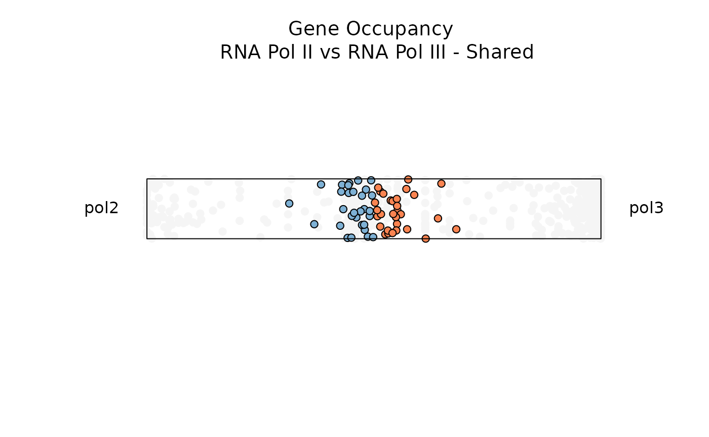

# Introduction to dominatR

## Overview


`dominatR` is a genomic data visualization package that applies concepts
drawn from physics - such as *center of mass* from classical mechanics
and *Shannon’s entropy* from statistical mechanics - to effectively
visualize features (e.g. genes) that are present within a specific
context or condition (e.g. tissue-specific gene expression). `dominatR`
is able to integrate `dataframes`, `matrices` and `SummarizedExperiment`
objects, perform a number of common genomic normalization methods,
compute center of mass, entropy, and categorical entropy values, and
generate customizable plots that serve to highlight context-relevant
feature dominance. In all examples, dominance visualization is linked to
the coordinate spatial localization of each data point, such that full
feature dominance is projected at the radial extreme.

`dominatoR` package functions can be subgrouped into the following
categories:

- **Normalization Functions:** Contains basic normalization methods,
  such as:

  - `cpm_normalization`

  - `minmax_normalization`

  - `quantile_normalization`

  - `rpkm_normalization`

  - `tpm_normalization`

- **Calculation Functions:** Contains feature calculation methods, such
  as:

  - `centmass`

  - `entropy`

  - `Qentropy`

- **Visualization Functions:** Contains three different visualization
  tools, ideal for assessing dominance in 2, 3 and N Dimension:

  - `plot_rope`

  - `plot_triangle`

  - `plot_circle`

This vignette serves as a quick tutorial for using `dominatR`. Further
descriptions and examples of customization and the additional features
present in the package can be explored in the companion articles.

## Installation

To install this package, start R and enter

``` r
library(BiocManager)
BiocManager::install('dominatR')
```

## Data normalization; computing and plotting feature dominance

The data included in this vignette can be found in the `airway` dataset
and the supplementary package `dominatRData`

### Normalization functions (e.g. quantile normalization)

#### Example 1: `SummarizedExperiment` object

``` r
data("airway")

se = quantile_normalization(airway, new_assay_name = 'quantile_norma')

head(se)
#> class: RangedSummarizedExperiment 
#> dim: 6 8 
#> metadata(1): ''
#> assays(2): counts quantile_norma
#> rownames(6): ENSG00000000003 ENSG00000000005 ... ENSG00000000460
#>   ENSG00000000938
#> rowData names(10): gene_id gene_name ... seq_coord_system symbol
#> colnames(8): SRR1039508 SRR1039509 ... SRR1039520 SRR1039521
#> colData names(9): SampleName cell ... Sample BioSample
head(assay(se, 'quantile_norma'))
#>                 SRR1039508 SRR1039509 SRR1039512 SRR1039513 SRR1039516
#> ENSG00000000003    690.875    504.750    773.875     613.75   1010.000
#> ENSG00000000005      0.000      0.000      0.000       0.00      0.000
#> ENSG00000000419    468.875    582.375    550.625     552.00    516.875
#> ENSG00000000457    257.375    241.375    225.250     254.00    213.125
#> ENSG00000000460     58.000     65.250     31.500      53.75     67.750
#> ENSG00000000938      0.000      0.000      1.250       0.00      0.375
#>                 SRR1039517 SRR1039520 SRR1039521
#> ENSG00000000003    757.375    878.250    608.750
#> ENSG00000000005      0.000      0.000      0.000
#> ENSG00000000419    582.125    467.500    541.625
#> ENSG00000000457    244.125    257.375    251.125
#> ENSG00000000460     48.375     79.875     66.000
#> ENSG00000000938      0.000      0.000      0.000
```

#### Example 2: `dataframe` object

``` r
data("atac_tissue_counts")

## selecting the numeric columns
norm = atac_tissue_counts[,8:26]

norm1 = quantile_normalization(norm)

head(norm1[,1:10])
#>           Heart     Spleen      Liver      Colon Adrenal.Gland       Lung
#> [1,]   11.26316   15.36842   13.00000   21.73684     13.789474   11.15789
#> [2,] 1369.78947 2997.36842 1679.36842 1422.52632   1486.421053 1549.94737
#> [3,]   17.78947   32.26316   57.89474   25.15789     21.789474   26.31579
#> [4,]   15.63158   14.78947   19.52632   22.78947      8.263158   15.26316
#> [5,]   17.78947   21.84211   20.84211   21.73684     15.000000   21.36842
#> [6,]   13.52632   18.57895   16.21053   17.89474     10.473684   13.10526
#>         Pancreas Gallbladder Urinary.Tract     Breast
#> [1,]    9.052632    11.89474      12.89474   14.26316
#> [2,] 1220.842105  1432.63158    1513.47368 1613.84211
#> [3,]   18.210526    16.84211      17.47368   19.42105
#> [4,]   14.894737    22.10526      14.68421   10.89474
#> [5,]   18.210526    20.00000      22.63158   16.52632
#> [6,]   10.631579    11.89474      25.10526   25.00000
```

### Calculation functions (e.g. entropy)

#### Example 1: `SummarizedExperiment` object

``` r

se = entropy(se)

head(se)
#> class: RangedSummarizedExperiment 
#> dim: 6 8 
#> metadata(1): ''
#> assays(3): counts quantile_norma Entropy
#> rownames(6): ENSG00000000003 ENSG00000000005 ... ENSG00000000460
#>   ENSG00000000938
#> rowData names(11): gene_id gene_name ... symbol Entropy
#> colnames(8): SRR1039508 SRR1039509 ... SRR1039520 SRR1039521
#> colData names(9): SampleName cell ... Sample BioSample

### It creates a new column in the rowData dataframe
head(rowData(se))
#> DataFrame with 6 rows and 11 columns
#>                         gene_id   gene_name  entrezid   gene_biotype
#>                     <character> <character> <integer>    <character>
#> ENSG00000000003 ENSG00000000003      TSPAN6        NA protein_coding
#> ENSG00000000005 ENSG00000000005        TNMD        NA protein_coding
#> ENSG00000000419 ENSG00000000419        DPM1        NA protein_coding
#> ENSG00000000457 ENSG00000000457       SCYL3        NA protein_coding
#> ENSG00000000460 ENSG00000000460    C1orf112        NA protein_coding
#> ENSG00000000938 ENSG00000000938         FGR        NA protein_coding
#>                 gene_seq_start gene_seq_end    seq_name seq_strand
#>                      <integer>    <integer> <character>  <integer>
#> ENSG00000000003       99883667     99894988           X         -1
#> ENSG00000000005       99839799     99854882           X          1
#> ENSG00000000419       49551404     49575092          20         -1
#> ENSG00000000457      169818772    169863408           1         -1
#> ENSG00000000460      169631245    169823221           1          1
#> ENSG00000000938       27938575     27961788           1         -1
#>                 seq_coord_system      symbol   Entropy
#>                        <integer> <character> <numeric>
#> ENSG00000000003               NA      TSPAN6  2.917466
#> ENSG00000000005               NA        TNMD  0.000000
#> ENSG00000000419               NA        DPM1  2.961022
#> ENSG00000000457               NA       SCYL3  2.975398
#> ENSG00000000460               NA    C1orf112  2.955338
#> ENSG00000000938               NA         FGR  0.918296
```

#### Example 2: `dataframe` object

``` r

norm1 = entropy(norm)

### It creates a new column in the dataframe
head(norm1[,10:20])
#>       Breast Fallopian.Tube Psoas.Muscle  Vena.Cava Gastroesophageal.Sphincter
#> 1 0.06137184     0.06859206   0.02166065 0.06137184                 0.05415162
#> 2 0.02719477     0.05415596   0.08358637 0.05121959                 0.04261070
#> 3 0.05176471     0.05176471   0.02117647 0.05647059                 0.04705882
#> 4 0.04362416     0.07046980   0.03020134 0.05369128                 0.04362416
#> 5 0.04679803     0.11576355   0.01970443 0.06896552                 0.05665025
#> 6 0.07715134     0.04747774   0.02373887 0.05934718                 0.08902077
#>   Adipose.Tissue Sciatic.Nerve Ovary...Uterus    Stomach      Brain  Entropy
#> 1     0.04332130    0.06498195     0.05415162 0.05415162 0.12635379 4.090040
#> 2     0.03967433    0.06907137     0.07921519 0.02816243 0.03717174 4.137985
#> 3     0.04235294    0.06117647     0.05176471 0.04235294 0.06823529 4.116397
#> 4     0.05704698    0.04362416     0.04697987 0.06711409 0.10402685 4.123750
#> 5     0.04926108    0.04679803     0.03940887 0.04187192 0.11576355 4.071279
#> 6     0.05341246    0.05934718     0.05341246 0.05044510 0.11275964 4.062376
```

### Visualization functions (2-, 3-, and N-dimensions)

All `dominatR` package functions are compatible with
`SummarizedExperiment` and `data.frame` objects. This quick introduction
will show examples using `data.frame` objects. Each function produces a
graphic and a `data.frame` with the dominance results; setting the
attribute `output_table = FALSE` will restrict the dataframe from being
displayed. For more details and examples on usage and aesthetics
manipulation, refer to the articles in the visualization section.

#### Example 1: Two Dimensions with `plot_rope()`

`plot_rope` is useful to visualize feature dominance between two
variables. In this example the function is comparing dominance over gene
occupancy for RNA Polymerase II and RNA Polymerase III. By default the
function plots all data points, but users can adjust `entropy_range`
values to subset on observations within a specified range.

``` r
data("rnapol_score")

data1 <- rnapol_score[,6:7]

plot_rope(
        data1, 
        rope_color = 'white',
        pch = c(21, 21), 
        push_text = 1.2,
        col = c('#7eb1d5', '#fa8451'),
        output_table = FALSE,
        rope_width = 1
)

title(main = 'Gene Occupancy RNA Pol II vs RNA Pol III',
        font.main = 1, 
        cex = 0.5)
```


\_\_\_\_\_\_\_\_\_\_\_\_\_\_\_\_\_\_\_\_\_\_\_\_\_\_\_\_\_

Below, let’s filter for genes with **low entropy** and high significance
scores to visualize genes that are specifically occupied by either RNA
Pol II or RNA Pol III

``` r

plot_rope(
        data1, 
        rope_color = 'white',
        pch = c(21, 21), 
        col = c('#7eb1d5', '#fa8451'),
        push_text = 1.2,
        output_table = FALSE,
        rope_width = 1,
        entropyrange = c(0, 0.5),
        maxvaluerange = c(1.3, Inf)
)


title(main = 'Gene Occupancy \n RNA Pol II vs RNA Pol III - Specific',
        font.main = 1, 
        cex = 0.5)
```


\_\_\_\_\_\_\_\_\_\_\_\_\_\_\_\_\_\_\_\_\_\_\_\_\_\_\_\_\_

Below, let’s filter for genes with **high entropy** and high
significance scores to visualize genes that are specifically occupied by
both RNA Pol II and RNA Pol III

``` r

plot_rope(
        data1,
        pch = c(21,21), 
        push_text = 1.2,
        rope_color = 'white',
        col = c('#7eb1d5', '#fa8451'),
        output_table = FALSE,
        rope_width = 1,
        entropyrange = c(0.8, 1),
        maxvaluerange = c(1.3, Inf)
)

title(main = 'Gene Occupancy \n RNA Pol II vs RNA Pol III - Shared',
        font.main = 1, 
        cex = 0.5)
```



#### Example 2: Three Dimensions with `plot_triangle()`

`plot_triange` is useful to visualize feature dominance between three
variables. In this example, the function is comparing dominance over
gene occupancy for RNA Polymerase I, RNA Polymerase II and RNA
Polymerase III. By default the function plots every data point, but
users can again adjust the `entropy_range` attribute values to subset on
observations within a specified range.

``` r
data1 <- rnapol_score[,5:7]

plot_triangle(data1,
                output_table = FALSE,
                col = c('#ff80e3', '#7eb1d5', '#fa8451'),
                label = TRUE, pch = 21, 
                push_text = 1.3)

title(main = 'Gene Occupancy \n Pol I vs Pol II vs Pol III',
        font.main = 1, 
        cex = 0.5)
```


\_\_\_\_\_\_\_\_\_\_\_\_\_\_\_\_\_\_\_\_\_\_\_\_\_\_\_\_\_

Below, let’s filter for genes with **low entropy** and high significance
scores to visualize genes that are specifically occupied by either RNA
Pol I, RNA Pol II, or RNA Pol III

``` r
data1 <- rnapol_score[,5:7]

plot_triangle(data1, 
                output_table = FALSE, 
                col = c('#ff80e3', '#7eb1d5', '#fa8451'),
                entropyrange = c(0,0.5),
                label = TRUE, pch = 21,
                push_text = 1.3)

title(main = 'Gene Occupancy \n Pol I vs Pol II vs Pol III - Specific',
        font.main = 1, 
        cex = 0.5)
```


\_\_\_\_\_\_\_\_\_\_\_\_\_\_\_\_\_\_\_\_\_\_\_\_\_\_\_\_\_

Below, let’s filter for genes with **high entropy** and high
significance scores to visualize genes that are specifically occupied by
all three RNA Pols or combinations of any 2 RNA Pols (e.g. RNA Pol I and
RNA Pol II)

``` r
data1 <- rnapol_score[,5:7]

plot_triangle(data1, 
                output_table = FALSE, 
                col = c('#ff80e3', '#7eb1d5', '#fa8451'),
                entropyrange = c(1.5, Inf),
                label = TRUE, pch = 21,
                push_text = 1.3)

title(main = 'Gene Occupancy \n Pol I vs Pol II vs Pol III - Shared',
        font.main = 1, 
        cex = 0.5)
```


Notice that as each data point gets closer to the center (and moving
away from the vertices), the observation is characterized by higher
entropy and is not dominated by a specific variable (in this case, by a
specific RNA polymerase).

#### Example 3: N-Dimensions with `plot_circle()`

`plot_circle` is useful to visualize feature dominance between N-Numbers
of variables. In this example, the function is comparing RNA-Pol III
transcribed genes accessibility across tissues. By default the function
plots all the points, but the user can adjust `entropy_range` values for
subsetting specific type of observations.

Briefly A total of P-1 (P = Number of Variables) circles are plotted and
they represent degrees of dominance.

- The outermost circle represents observations that are dominated only
  by one variable.

- The second outermost circle represents observations that are dominated
  by two variables.

- The innermost circle represents observations that are uniform across
  all variables.

``` r
data("atac_tissue_score")

### subsetting only a set of numerical columns
data1 = atac_tissue_score[,8:26]


plot_circle(data1, 
            point_line_colors = rep('black', 19),
            magnituderange = c(1, Inf),
            n = 19, 
            output_table = FALSE, 
            point_size = 3) + 
ggtitle('Pol III transcribed genes \n accessibility across tissues')
```


``` r
data("atac_tissue_score")


plot_circle(data1, 
            point_line_colors = rep('black', 19),
            entropyrange = c(0,1), 
            magnituderange = c(1, Inf),
            straight_points = FALSE, 
            n = 19, 
            output_table = FALSE, 
            point_size = 3) + 
ggtitle('Pol III transcribed genes \n accessibility across tissues - Unique')
```


``` r
data("atac_tissue_score")

plot_circle(data1, 
            point_line_colors = rep('black', 19),
            entropyrange = c(4, Inf),
            magnituderange = c(1, Inf),
            n = 19, 
            output_table = FALSE,
            point_size = 3) + 
ggtitle('Pol III transcribed genes \n accessibility across tissues - Shared')
```


### Session Info

    #> R version 4.5.2 (2025-10-31)
    #> Platform: x86_64-pc-linux-gnu
    #> Running under: Ubuntu 24.04.3 LTS
    #> 
    #> Matrix products: default
    #> BLAS:   /usr/lib/x86_64-linux-gnu/openblas-pthread/libblas.so.3 
    #> LAPACK: /usr/lib/x86_64-linux-gnu/openblas-pthread/libopenblasp-r0.3.26.so;  LAPACK version 3.12.0
    #> 
    #> locale:
    #>  [1] LC_CTYPE=C.UTF-8       LC_NUMERIC=C           LC_TIME=C.UTF-8       
    #>  [4] LC_COLLATE=C.UTF-8     LC_MONETARY=C.UTF-8    LC_MESSAGES=C.UTF-8   
    #>  [7] LC_PAPER=C.UTF-8       LC_NAME=C              LC_ADDRESS=C          
    #> [10] LC_TELEPHONE=C         LC_MEASUREMENT=C.UTF-8 LC_IDENTIFICATION=C   
    #> 
    #> time zone: UTC
    #> tzcode source: system (glibc)
    #> 
    #> attached base packages:
    #> [1] stats4    stats     graphics  grDevices utils     datasets  methods  
    #> [8] base     
    #> 
    #> other attached packages:
    #>  [1] ggplot2_4.0.1               airway_1.30.0              
    #>  [3] SummarizedExperiment_1.40.0 Biobase_2.70.0             
    #>  [5] GenomicRanges_1.62.0        Seqinfo_1.0.0              
    #>  [7] IRanges_2.44.0              S4Vectors_0.48.0           
    #>  [9] BiocGenerics_0.56.0         generics_0.1.4             
    #> [11] MatrixGenerics_1.22.0       matrixStats_1.5.0          
    #> [13] dominatRData_0.99.1         dominatR_0.99.5            
    #> [15] knitr_1.50                 
    #> 
    #> loaded via a namespace (and not attached):
    #>  [1] sass_0.4.10         SparseArray_1.10.1  lattice_0.22-7     
    #>  [4] digest_0.6.38       magrittr_2.0.4      RColorBrewer_1.1-3 
    #>  [7] evaluate_1.0.5      grid_4.5.2          fastmap_1.2.0      
    #> [10] jsonlite_2.0.0      Matrix_1.7-4        ggnewscale_0.5.2   
    #> [13] scales_1.4.0        tweenr_2.0.3        textshaping_1.0.4  
    #> [16] jquerylib_0.1.4     abind_1.4-8         cli_3.6.5          
    #> [19] rlang_1.1.6         polyclip_1.10-7     XVector_0.50.0     
    #> [22] withr_3.0.2         cachem_1.1.0        DelayedArray_0.36.0
    #> [25] yaml_2.3.10         S4Arrays_1.10.0     tools_4.5.2        
    #> [28] dplyr_1.1.4         vctrs_0.6.5         R6_2.6.1           
    #> [31] lifecycle_1.0.4     fs_1.6.6            MASS_7.3-65        
    #> [34] ragg_1.5.0          pkgconfig_2.0.3     desc_1.4.3         
    #> [37] pkgdown_2.2.0       bslib_0.9.0         pillar_1.11.1      
    #> [40] gtable_0.3.6        glue_1.8.0          ggforce_0.5.0      
    #> [43] systemfonts_1.3.1   xfun_0.54           tibble_3.3.0       
    #> [46] tidyselect_1.2.1    farver_2.1.2        htmltools_0.5.8.1  
    #> [49] labeling_0.4.3      rmarkdown_2.30      compiler_4.5.2     
    #> [52] S7_0.2.1            geomtextpath_0.2.0
